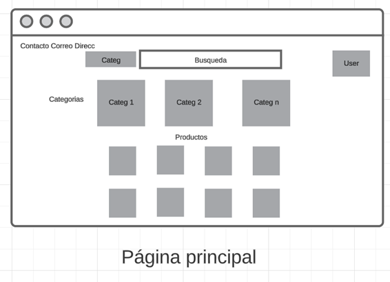

# TP INTEGRADOR
## POOII - Grupo G - 2024

 ## Doc ERP
# Especificación de Requisitos de Software 

## Contenido
### 1.1. Escenario 
El proyecto es un sistema de software para la venta de productos ecológicos en línea. Los productos se pueden vender individualmente o en paquetes. El sistema debe permitir la
gestión de inventario, el cálculo de precios con descuentos y la integración con múltiples métodos de pago.

### 1.2. Clientes potenciales
Los clientes potenciales en este caso, seran consumidores individuales,
que desean adquirir productos ecológicos para su uso personal y que 
estan familiarizados con la compra de productos en linea.
### 1.3. Solución propuesta
La solución consiste en el desarrollo de un sistema de 
comercio electrónico que permita la compra y venta de productos ecológicos.
Los detalles de la estructura del desarrollo estan en los requisitos de softwares)
### 1.4. Arquitectura de software
- Modelo: Tiene las clases que forman el sistema.
- Servicios: Tiene la logica de negocio.
- Repositorio: Encargado de la conexion con la base de datos.
- Controladores:  encargados de manejar la interacción entre el sistema y el usuario o cliente, maneja los empoints url uri etc.

### 2. Requisitos del sistema
#### 2.1 Requisitos funcionales 
-**Gestión de Productos**:
Registrar nuevos productos ecológicos.
- Eliminar productos.
- Editar la cantidad de productos.
- Consultar productos.

**Venta de productos**:
- Permitir la venta de productos individualmente.
- Permitir la creación y venta de paquetes de productos.
- Cálculo de precios según cantidad y ofertas por descuentos

**Gestión de pagos**:
- Implementar múltiples métodos de pago (tarjeta de crédito, débito, efectivo, cheque, etc.).
- Validar y procesar los pagos.
- Generar comprobantes.

**Gestión de Clientes**:
- Registrar nuevos clientes.
- Eliminar clientes.
- Editar clientes.
- Consultar clientes.

**Gestión de Usuarios**:
- Registrar nuevo usuario.
- Editar usuario.

#### 2.2. Requisitos funcionales
- Usabilidad
- Seguridad
- Disponibilidad
- Mantenible
- Escalabilidad
- Compatibilidad

## 3. Diagramas
### 3.1. Diagramas UML

### 3.2. Diagrama de casos de uso

### 3.3. Wireframe

---

## 4. Anexos
- [Link al repositorio del proyecto](https://github.com/krutkidaniel2020/TP-Integrador-POO-II-2024-Grupo-G)
- [Link al Diagrama de clases](https://lucid.app/lucidchart/3a95d578-62f8-4deb-970f-735bc61bd399/edit?invitationId=inv_274d60e4-6fa3-4efb-9a2c-bf391ce77002)
- [Link al Diagrama de casos de uso](https://lucid.app/lucidchart/1b27851e-6b6f-4e83-b1d2-3bb51eacdb22/edit?invitationId=inv_e99d1c86-608c-4823-8944-699316cdb3dd)
- [Link al Diagrama Wireframe](https://lucid.app/lucidchart/b21a08b5-faac-41d8-8677-d85988fbb925/edit?viewport_loc=58%2C-154%2C2310%2C1047%2C0_0&invitationId=inv_6d2672cb-c31e-4b3e-8581-e1fdc365a63f)