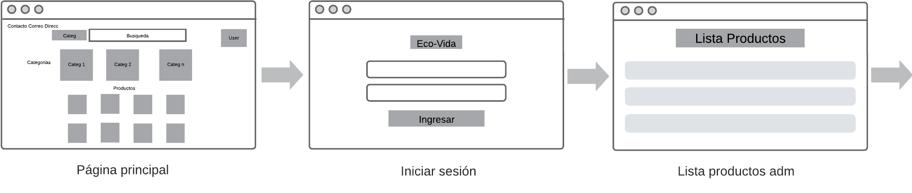

# Trabajo en equipo
- Dp-Iteracion 1: Schiaffino Alejandro Thiago
- Roadmap: Schiaffino Alejandro Thiago 
- Diagrama uml: Krutki Daniel, Schiaffino Alejandro Thiago
- Erp: Krutki Daniel
- Casos de usos: Krutki Daniel
- Wireframe: Krutki Daniel
- BD: Krutki Daniel
- Diseño de software: Krutki Daniel
- Doc javadoc: Krutki Daniel
- Issues: Krutki Daniel

 

# Diseño OO

 

# Wireframe y caso de uso
## UC- 01 - Ver Productos
**Descripción**: El usuario visualiza una lista de productos disponibles en el sistema. 
**Actor(es)**: Usuario   
**Precondición**:   
**Postcondición**: Se muestra una lista de productos al usuario.   
**Flujo Principal**:
1. El usuario selecciona la opción "Ver Productos". 
2. El sistema muestra una lista de productos. 

--- 

## UC-02 - Alta Cliente
**Descripción**: Un nuevo cliente se registra en el sistema para realizar compras.  
**Actor(es)**: Cliente  
**Precondición**:    
- El cliente no debe existir en el sistema.  
**Postcondición**:  
- Se crea un nuevo cliente en el sistema.  

**Flujo Principal**:    
1. El cliente accede a la página de registro.  
2. El sistema muestra un formulario con los datos a completar para su registro.  
3. El cliente completa el formulario de registro con los siguientes datos: id, dni, apellido, nombre, fecha, dirección, email, teléfono.  
4. El sistema valida los datos ingresados.  
5. El sistema crea un nuevo cliente en el sistema e informa al nuevo cliente.  
**Flujo Alternativo**:    
- **4a.** Si uno de los datos no es válido, el sistema envía un mensaje de error informando el problema.  
- **4b.** Si el id del cliente ya existe, se muestra un mensaje solicitando un nuevo id para ingresar en el campo correspondiente.   
  
**Comentarios**:  
- Ninguno.  

---

## UC-03 - Baja Cliente
**Descripción**: Se da de baja a un cliente en el sistema.  
**Actor(es)**: Cliente   

**Precondición**:  
- El cliente debe existir en el sistema.  
**Postcondición**:  
- Se elimina de manera lógica al cliente del sistema.  

**Flujo Principal**:  
1. El cliente accede a su perfil.  
2. El cliente selecciona la opción "Darse de baja".  
3. Se muestra un mensaje de confirmación preguntando si está seguro de darse de baja.  
4. El cliente acepta la solicitud del sistema.  
5. Se muestra un mensaje de confirmación indicando que su perfil ha sido eliminado.  

**Flujo Alternativo**:   
- **2a.** Si el cliente posee pedidos pendientes, se le impide eliminar la cuenta hasta que los pedidos sean procesados.  

**Comentarios**:  
- Ninguno.  

---

## UC-04 - Modificar Cliente
**Descripción**: Un cliente modifica sus datos personales.  
**Actor(es)**: Cliente  
**Precondición**:  
- El cliente debe existir en el sistema.  

**Postcondición**:  
- Se actualizan los datos del cliente en el sistema.  

**Flujo Principal**:  
1. El cliente accede a su perfil.  
2. Se muestran los datos actuales del cliente en un formulario editable.  
3. El cliente realiza los cambios necesarios en sus datos.  
4. El sistema valida los datos modificados.  
5. Si los datos son válidos, se actualizan los datos del cliente en la base de datos.  
6. Se muestra un mensaje de confirmación indicando que los cambios se han guardado correctamente.  

**Flujo Alternativo**:  
- **4a.** Si uno de los datos no es válido, el sistema envía un mensaje de error informando el problema.  

**Comentarios**:  
- Ninguno.  

---

## UC-05 - Ver Clientes
**Descripción**: El usuario visualiza una lista de clientes registrados en el sistema.  
**Actor(es)**: Usuario - Admin  
**Precondición**:  
- Ninguna.  

**Postcondición**:  
- Se muestra una lista de clientes.  

**Flujo Principal**:  
1. El usuario selecciona la opción "Ver Clientes".  
2. El sistema muestra una lista de clientes donde puede realizar acciones.  

**Flujo Alternativo**:  
- Ninguno.  

**Comentarios**:  
- Ninguno.  

---

## UC-06 - Alta Usuario
**Descripción**: Un nuevo usuario se registra en el sistema.  
**Actor(es)**: Usuario  
**Precondición**:  
- El usuario no debe existir en el sistema.  

**Postcondición**:  
- Se crea un nuevo usuario en el sistema.  

**Flujo Principal**:  
1. El usuario accede a la página de registro.  
2. El sistema muestra un formulario con los datos a completar para su registro.  
3. El usuario completa el formulario de registro con los siguientes datos: id, dni, contraseña, categoría.  
4. El sistema valida los datos ingresados.  
5. El sistema crea un nuevo usuario en el sistema e informa al usuario.  

**Flujo Alternativo**:  
- **4a.** Si uno de los datos no es válido, el sistema envía un mensaje de error informando el problema.  
- **4b.** Si el id del usuario ya existe, se muestra un mensaje solicitando un nuevo id para ingresar en el campo correspondiente.  

**Comentarios**:  
- Ninguno.  

---

## UC-07 - Baja Usuario
**Descripción**: Un usuario se da de baja en el sistema.  
**Actor(es)**: Usuario  

**Precondición**:  
- El usuario debe existir en el sistema.  

**Postcondición**:  
- Se elimina de manera lógica al usuario del sistema.  

**Flujo Principal**:  
1. El usuario accede a su perfil.  
2. El usuario selecciona la opción "Darse de baja".  
3. Se muestra un mensaje de confirmación preguntando si está seguro de darse de baja.  
4. El usuario acepta la solicitud del sistema.  
5. Se muestra un mensaje de confirmación indicando que su perfil ha sido eliminado.  

**Flujo Alternativo**:  
- **2a.** Si el usuario posee pedidos pendientes, se le impide eliminar la cuenta hasta que los pedidos sean procesados.  

**Comentarios**:  
- Ninguno.  

---

## UC-08 - Modificar Usuario
**Descripción**: Un usuario modifica sus datos personales.  
**Actor(es)**: Usuario  

**Precondición**:  
- El usuario debe existir en el sistema.  

**Postcondición**:  
- Se actualizan los datos del usuario en el sistema.  

**Flujo Principal**:  
1. El usuario accede a su perfil.  
2. Se muestran los datos actuales del usuario en un formulario editable.  
3. El usuario realiza los cambios necesarios en sus datos.  
4. El sistema valida los datos modificados.  
5. Si los datos son válidos, se actualizan los datos del usuario en la base de datos.  
6. Se muestra un mensaje de confirmación indicando que los cambios se han guardado correctamente.  

**Flujo Alternativo**:  
- **4a.** Si uno de los datos no es válido, el sistema envía un mensaje de error informando el problema.  

**Comentarios**:  
- Ninguno.  

---

## UC-09 - Alta Categoría
**Descripción**: Un usuario registra una nueva categoría de producto en el sistema.  
**Actor(es)**: Usuario  

**Precondición**:  
- La categoría no debe existir en el sistema.  

**Postcondición**:  
- Se crea una nueva categoría en el sistema.  

**Flujo Principal**:  
1. El usuario accede a su perfil.  
2. El usuario solicita dar de alta una nueva categoría.  
3. El sistema muestra dos campos a completar: id y nombre de categoría.  
4. El usuario completa los campos.  
5. El sistema valida los campos.  
6. El sistema crea una nueva categoría en el sistema.  

**Flujo Alternativo**:  
- **5a.** Si la categoría ya existe en el sistema, se informa mediante un mensaje de error y se solicita la corrección del dato.  

**Comentarios**:  
- Ninguno.  

---

## UC-10 - Baja Categoría
**Descripción**: Un usuario elimina una categoría de producto en el sistema.  
**Actor(es)**: Usuario  

**Precondición**:  
- La categoría debe existir en el sistema.  

**Postcondición**:  
- Se elimina una categoría de manera lógica en el sistema.  

**Flujo Principal**:  
1. El usuario busca una categoría por su id o nombre.  
2. El sistema muestra la categoría buscada.  
3. El usuario solicita dar de baja la categoría.  
4. El sistema consulta si está seguro de eliminar dicha categoría.  
5. El usuario acepta.  
6. El sistema elimina la categoría y se le informa al usuario.  

**Flujo Alternativo**:  
- **1a.** Si la categoría no existe, se le informa al usuario y termina el caso de uso.  
- **3a.** Si hay algún producto asociado a dicha categoría, entonces la eliminación de la categoría se cancela.  

**Comentarios**:  
- Ninguno.  

---

### Restablecimiento de contraseña

 

# Backlog de iteraciones
| **ID**       | [HU01]                 |
|--------------|-------------------------|
| **Título**   | Ver productos           |
| **Como**     | Cliente                 |
| **Quiero**   | Visualizar los productos ecológicos |
| **Para**     | Seleccionar los productos a comprar |

| **ID**       | [HU02]                 |
|--------------|-------------------------|
| **Título**   | Realizar descuentos     |
| **Como**     | Cliente                 |
| **Quiero**   | Se realiza un descuento al precio del producto |
| **Para**     | Se reduce el costo de la compra |

| **ID**       | [HU03]                 |
|--------------|-------------------------|
| **Título**   | Registrar Categoria |
| **Como**     | Usuario                 |
| **Quiero**   | Registrar una nueva categoria de producto |
| **Para**     | categorizar los productos del sistema |

| **ID**       | [HU04]                 |
|--------------|-------------------------|
| **Título**   | Buscar productos por categoría |
| **Como**     | Cliente                 |
| **Quiero**   | filtrar una lista de productos por su categoria |
| **Para**     | facilitar la búsqueda de un producto |

| **ID**       | [HU05]                 |
|--------------|-------------------------|
| **Título**   | Gestion cliente       |
| **Como**     | Cliente                 |
| **Quiero**   | Poder darme de alta, baja o modificar mi perfil en el sistema |
| **Para**     | realizar pedidos |

| **ID**       | [HU06]                 |
|--------------|-------------------------|
| **Título**   | Gestion usuario       |
| **Como**     | Usuario                 |
| **Quiero**   | Poder darme de alta, baja o modificar mi perfil en el sistema |
| **Para**     | formar parte de la gestion del sistema |

| **ID**       | [HU07]                 |
|--------------|-------------------------|
| **Título**   | Gestion producto       |
| **Como**     | Usuario                 |
| **Quiero**   | Registrar, eliminar o modificar productos |
| **Para**     | poder gestionar los productos del sistema |

 

##  Wireframe

  
  

 

# Tareas
- Se debe implementar abm de usuarios, abm de productos, abm de clientes, y gestion de categorias.
- Respecto al poco tiempo para el desarrollo del trabajo, tuvimos que repartirnos las tareas.

